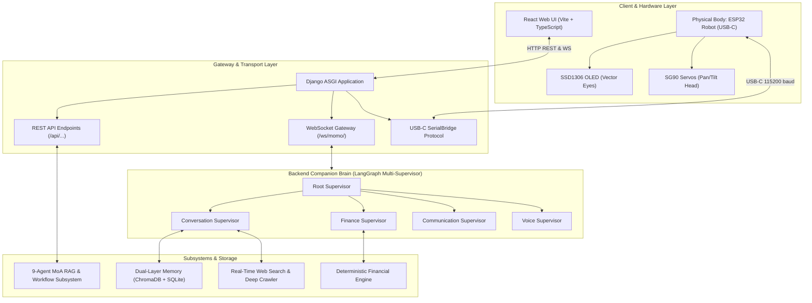
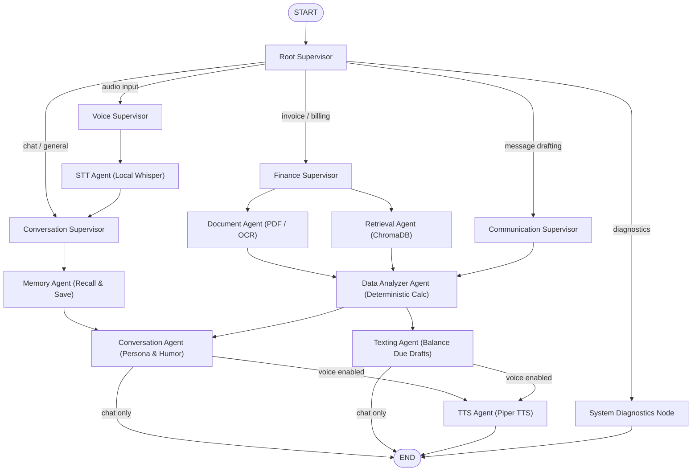
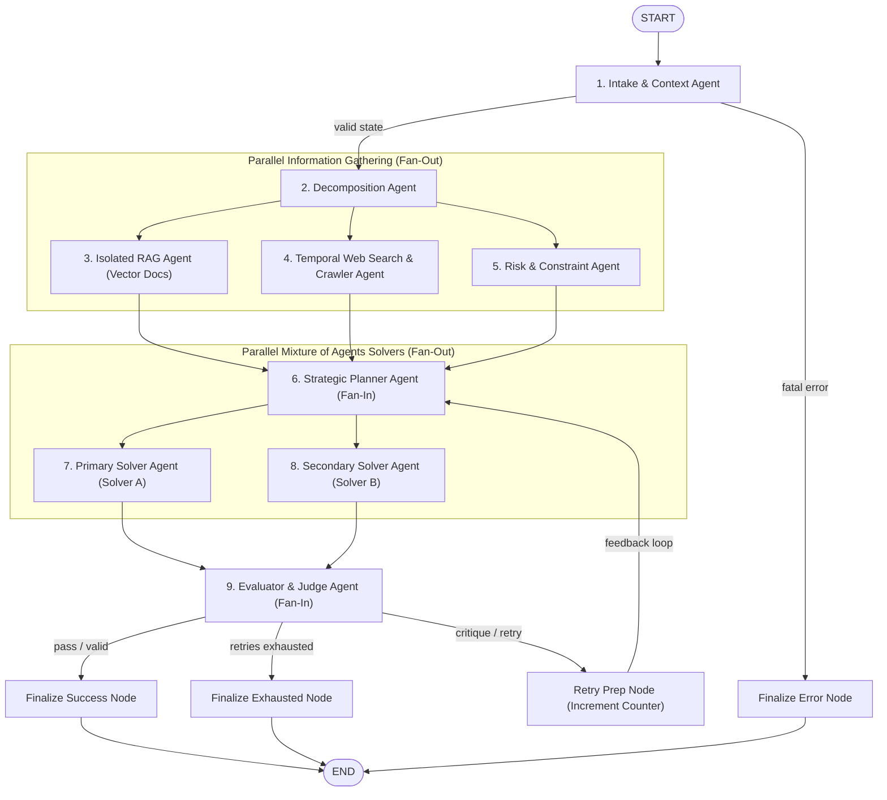
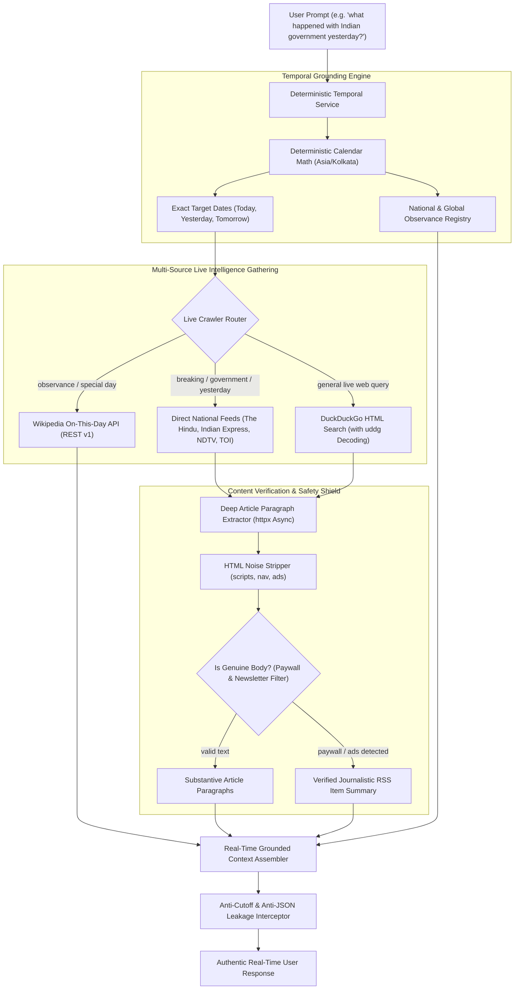
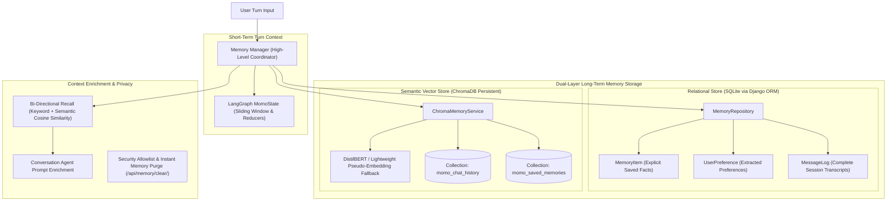

# 🤖 MOMO — Local-First Physical AI Companion

> **The Laptop is MOMO's Brain. The ESP32 is MOMO's Physical Body.**

MOMO is a production-quality, modular, local-first AI companion platform that combines an expressive digital companion in React with an animated physical robotic body built on ESP32, coordinated by a LangGraph multi-supervisor state workflow and a 9-agent Mixture of Agents (MoA) subsystem.

---

## 🌟 Key Capabilities

- **100% Local Intelligence**: Powered by Ollama (`qwen3:4b`, `llama3`, `mistral`, etc.) without mandatory cloud APIs.
- **Physical Robotic Body (ESP32)**:
  - **One-Click USB-C Connection**: Plug the ESP32 into your laptop via USB-C and launch with `start_momo.bat`.
  - **SSD1306 128x64 OLED**: Renders vector eyes and animated facial expressions in real time.
  - **SG90 Micro Servos**: Pan and tilt head articulations (nod, tilt, celebrate, wave).
  - **Status LED & Pushbutton**: Interactive tactile feedback and hardware event bridge.
- **LangGraph Multi-Supervisor Orchestration**:
  - **Root Supervisor**: Dispatches conversational turns to specialized supervisors.
  - **Conversation Supervisor**: Persona, humor, small-talk, and long-term memory retrieval.
  - **Finance Supervisor**: Invoice parsing, sentence-level BERT contextual analysis, and DistilBERT + ChromaDB retrieval.
  - **Communication Supervisor**: Deterministic balance-due message drafting via the Texting Agent.
  - **Voice Supervisor**: Local Whisper STT and Piper TTS interfaces.
- **Multi-Agent RAG & Workflow Subsystem (`Backend/ai_workflow`)**:
  - **9 Specialized Agents (MoA Architecture)**: Context, Decomposition, Isolated RAG, Temporal Web Search, Risk & Constraint, Planning, Primary Solver (A), Secondary Solver (B), and Evaluator / Judge.
  - **Mixture of Agents (MoA) Parallel Execution**: Parallel solver branches with synchronized fan-in and structured Pydantic evaluation.
  - **Real-Time Web Search & Deep Article Crawler**:
    - Zero-cost live news retrieval via direct national RSS feeds (The Hindu, Indian Express, NDTV, Times of India) with exact `pubDate` timestamps.
    - Wikipedia On This Day API (`https://en.wikipedia.org/api/rest_v1/feed/onthisday/holidays/{month}/{day}`) for real-time holidays and observances.
    - DuckDuckGo search with `uddg` parameter decoding for general web queries.
    - Asynchronous `httpx` article paragraph extraction with paywall, newsletter, and boilerplate filtration.
  - **Deterministic Temporal Grounding**:
    - Computes calendar math deterministically (`today`, `yesterday`, `tomorrow`, day of week, timezone `Asia/Kolkata`).
    - Resolves queries like *"what happened with Indian government yesterday?"* to exact date boundaries without LLM hallucinations.
    - Built-in national and international calendar observance registry for queries like *"what special today is?"*.
  - **Anti-Hallucination & Conditional Retry Loop**: Deterministic critique feedback, bounded confidence (`0.0 - 1.0`), and strict zero-citation fabrications.
  - **Anti-JSON Leakage & Cutoff Disclaimer Defense**:
    - Multi-layer shield across System Prompts, Parsers, Agents, and Frontend UI preventing raw JSON brackets or AI knowledge cutoff excuses from ever entering the chat.
  - **Tenant & Project Isolation**: Partitioned vector search and execution history with zero cross-tenant leakage.
  - **Deterministic Mock Mode**: Full offline execution path via `AI_MOCK_MODE=true` without external API credentials.
- **Hybrid Memory System (Short-Term & Long-Term Semantic Vector Memory)**:
  - **SQLite Relational Store**: Tracks conversations (`MessageLog`), explicit user-saved memories (`MemoryItem`), and extracted user preferences (`UserPreference`).
  - **ChromaDB Semantic Vector Store**: Persistent collections (`momo_chat_history`, `momo_saved_memories`) with cosine similarity indexing and DistilBERT embeddings.
  - **Bi-Directional Recall**: Blends exact keyword match and semantic vector search to enrich conversation context.
- **Deterministic Financial Safety**:
  - Arithmetic source of truth: `Balance Due = Invoice Total - Amount Paid`.
  - The generative LLM is never allowed to hallucinate financial figures.
- **Privacy & Security Allowlisting**:
  - Camera, mic, and memory toggles with instant data wipe.
  - Hardware commands strictly validated against allowlists before transmission.
- **RTX 2050 GPU Optimization**:
  - Low-VRAM footprint (4GB target) with `torch.inference_mode()`, CUDA memory clearing, and seamless CPU fallback upon CUDA OOM.

---

## 🏗️ Backend Architecture

MOMO's backend is architected around two coordinated LangGraph state machines:
1. **The Companion Brain Graph** (`Backend/graph/graph.py`): Handles real-time multi-modal companion interaction, hardware telemetry, voice, finance, and memory.
2. **The Mixture of Agents (MoA) Workflow Graph** (`Backend/ai_workflow/graph.py`): An enterprise-grade, 9-agent reasoning engine that performs deep retrieval, live web crawling, risk analysis, multi-solver generation, and structured evaluation.

### 1. High-Level System Architecture



---

### 2. LangGraph Multi-Supervisor Companion Brain

The companion brain coordinates turn-by-turn routing across supervisors and specialized agents on a shared `MomoState`.



---

### 3. 9-Agent Mixture of Agents (MoA) Subsystem

Located in `Backend/ai_workflow`, this DAG implements parallel fan-out and synchronized fan-in merges across 9 specialized agents with an anti-hallucination critique loop:



| Agent | Responsibility | Key Output |
| :--- | :--- | :--- |
| **1. Context Agent** | Normalizes input, verifies tenant/project boundaries, injects temporal anchors | Clean normalized task prompt |
| **2. Decomposition Agent** | Breaks complex goals into discrete subtasks and dependencies | Structured execution plan |
| **3. Isolated RAG Agent** | Performs vector similarity retrieval within isolated tenant corpus | Contextual document excerpts |
| **4. Temporal Web Search & Crawler** | Direct news feeds, Wikipedia observances, DuckDuckGo crawling | Authentic real-time news & context |
| **5. Risk & Constraint Agent** | Identifies compliance boundaries, hallucination risks, and guidelines | Risk assessment & safety bounds |
| **6. Strategic Planner Agent** | Integrates RAG, web intelligence, and risk constraints | Unified solution strategy |
| **7. Primary Solver (A)** | Detailed, comprehensive solution draft with citations | Candidate Solution A |
| **8. Secondary Solver (B)** | Concise, alternative formulation focusing on core precision | Candidate Solution B |
| **9. Evaluator / Judge Agent** | Cross-examines both candidates, scores confidence, validates claims | Synthesized final output or critique |

---

### 4. Real-Time Web Search & Deep Article Crawler Pipeline

The real-time intelligence engine solves the LLM knowledge-cutoff limitation without cloud API subscriptions.



#### How Real-Time Web Crawling Works:
1. **Temporal Grounding**: When a user asks *"what happened yesterday?"*, the `TemporalService` calculates the exact calendar date for `yesterday` in the user's timezone (`Asia/Kolkata`) rather than allowing the LLM to guess.
2. **Direct RSS Feeds**: Avoids Google News redirect wrappers by fetching directly from The Hindu, Indian Express, NDTV, and Times of India RSS feeds, retrieving real article URLs and authentic journalistic summaries.
3. **Wikipedia Observances API**: For queries like *"what special today is?"*, MOMO calls the official Wikipedia On This Day API (`https://en.wikipedia.org/api/rest_v1/feed/onthisday/holidays/{month}/{day}`) and cross-references its local calendar registry.
4. **Resilient Paragraph Scraping**: `LiveWebCrawlerService` extracts paragraphs (`<p>` tags), filtering out paywall blocks (`"subscribe now"`, `"subscribed with another email"`), newsletter banners, and promotional ads. If a paywall is detected, it cleanly falls back to the rich, verified RSS summary.
5. **Anti-Cutoff Shield**: Prevents the model from responding with boilerplate excuses (*"As an AI, my knowledge cutoff is..."*) by grounding the system prompt with live verified snippets and enforcing regex sanitation.

---

### 5. Hybrid Memory System Architecture

MOMO features a dual-layer memory system combining short-term conversational context with long-term semantic persistence.



#### How Memory Retrieval and Storage Operate:
- **Automatic Turn Indexing**: Completed user/assistant turns are asynchronously embedded and indexed into ChromaDB under collection `momo_chat_history`.
- **Explicit Memory Storage**: Statements such as *"remember that my dog's name is Milo"* trigger the `MemoryAgent`, writing the record into SQLite (`MemoryItem`) and embedding it into ChromaDB (`momo_saved_memories`).
- **Heuristic Preference Extraction**: Automatic regex and entity detection identify user preferences (likes, dislikes, projects) and store them in `UserPreference`.
- **Semantic + Keyword Hybrid Recall**: Prior to generating answers, `MemoryManager.recall_saved_memories()` queries both SQLite relational records and ChromaDB vector similarities, merging unique facts to enrich the prompt context.
- **Instant Data Wipe**: Users can erase all stored memories, chat vectors, and preferences instantly with one click via `/api/memory/clear/`.

---

## ⚡ Quickstart (One-Click Launch)

Simply double-click `start_momo.bat` in the root folder!
This will:
1. Connect to the USB-C ESP32 companion.
2. Start the Django ASGI Backend (`http://127.0.0.1:8000/`).
3. Start the React Frontend (`http://localhost:5173/`).
4. Launch your default browser directly into the MOMO dashboard.

---

## 📂 Project Structure

```text
momo/
├── Backend/
│   ├── ai_workflow/     # Multi-Agent MoA Subsystem (9 Agents, Web Search & Crawler, Temporal Service, LangGraph)
│   │   ├── agents/      # 9 MoA Agents (Context, Decomp, RAG, Web, Risk, Plan, Solvers A/B, Evaluator)
│   │   ├── services/    # LiveWebCrawlerService, TemporalGroundingService, MockAIService
│   │   ├── graph.py     # MoA LangGraph definition, fan-out/fan-in reducers, retry loop
│   │   └── state.py     # Pydantic WorkflowState, EvaluationResult, Citation
│   ├── api/             # Django REST Framework endpoints & serializers (/api/workflow/...)
│   ├── graph/           # Physical Companion MomoState, merge reducers, and LangGraph workflow
│   ├── supervisors/     # Root, Conversation, Finance, Communication, Voice
│   ├── agents/          # Companion agents (Conversation, Memory, Texting, Retrieval, DataAnalyzer, etc.)
│   ├── ai/              # Resilient OllamaClient, ModelManager, GPUManager (OOM recovery), ResponseParser
│   ├── memory/          # Dual-layer MemoryManager, ChromaMemoryService, SQLite MemoryRepository
│   ├── nlp/             # BERT contextual analysis & DistilBERT embeddings
│   ├── retrieval/       # ChromaDB document vector collections and semantic query filters
│   ├── documents/       # Parser, Chunker, and DocumentProcessor
│   ├── finance/         # Deterministic Calculator, Validator, and Extractor
│   ├── iot/             # USB-C SerialBridge, DeviceRegistry, Heartbeat, and Protocol
│   ├── security/        # Privacy permission toggles & hardware command allowlists
│   └── tests/           # Full unit and integration test suite (Temporal, Crawler, MoA, Memory, State)
├── Frontend/
│   ├── src/
│   │   ├── components/  # MomoAvatar, ChatWindow, DocumentUploader, InvoiceCard, Esp32Card, etc.
│   │   ├── services/    # REST API client & persistent WebSocket gateway (/ws/momo/)
│   │   └── App.tsx      # Main application with Dashboard, Chat, Documents, Finance, Settings
├── hardware/
│   └── esp32/           # PlatformIO project with C++ firmware for OLED, servos, and USB-C
├── docs/                # Architectural, state, agent, hardware, and API documentation
├── start_momo.bat       # Master one-click full-stack launcher
├── .env.example         # Environment template
└── README.md
```

---

## 🧪 Testing

Run the automated backend test suite from the `Backend/` directory:
```powershell
.\venv\Scripts\python.exe -m unittest discover -s tests -p "test_*.py" -v
```

Run targeted tests for the Live Crawler, Temporal Grounding, Vector Memory, and MoA Subsystems:
```powershell
.\venv\Scripts\python.exe -m unittest tests.test_response_sanitization tests.test_temporal_service tests.test_web_crawler_service tests.test_realtime_moa tests.test_vector_memory tests.test_state tests.test_supervisors tests.test_ai_workflow -v
```

Build the React frontend client:
```powershell
cd Frontend
npm run build
```

---

## 📜 License
MIT License. Built for the open-source physical AI companion community.
