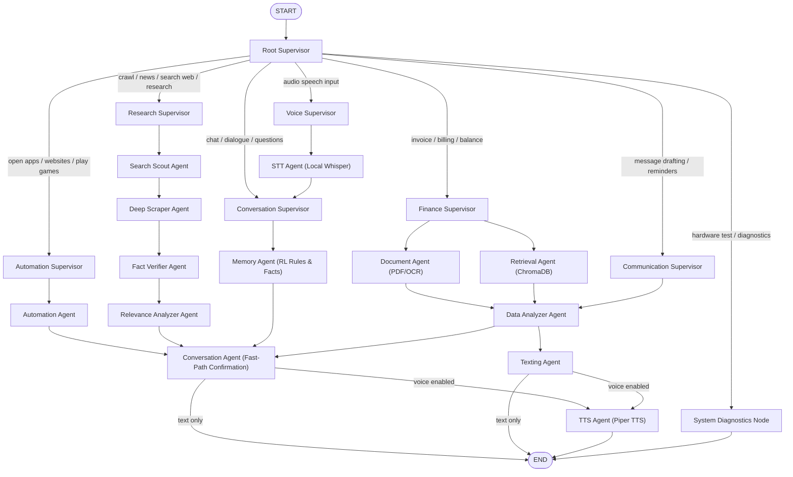
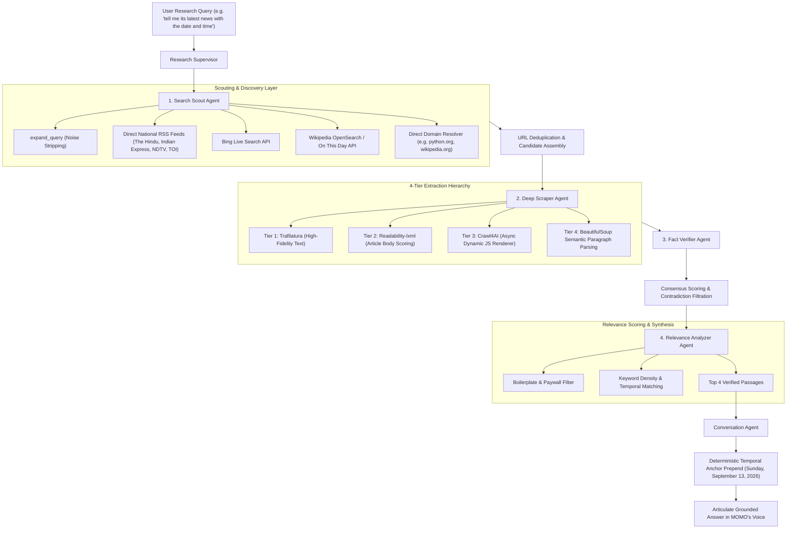

# 🤖 MOMO — Local-First Physical AI Companion & Autonomous Robotics Platform

> **The Laptop is MOMO's Brain. The ESP32 is MOMO's Physical Body. Computer Vision is MOMO's Eyes. Desktop Automation is MOMO's Hands.**

MOMO is a production-grade, modular, local-first AI companion robot platform. It seamlessly unifies an expressive digital React avatar, an animated ESP32 physical robotic body with OLED vector eyes and servo neck articulations, an 18-sensor FACS computer vision perception engine, a multi-supervisor LangGraph state machine, a 9-agent Mixture of Agents (MoA) research subsystem, and an autonomous desktop automation engine with reinforcement learning capabilities.

---

## 🌟 Key Capabilities & System Highlights

### 1. 100% Local Intelligence & Zero-Cloud Autonomy
- **Local LLM Inference**: Powered by local Ollama models (`hf.co/hugging-quants/Llama-3.2-1B-Instruct-Q8_0-GGUF:Q8_0`, `qwen3:4b`, `llama3`, `mistral`) running entirely on-device without mandatory cloud subscriptions or API fees.
- **GPU-Aware Execution**: Optimized for resource-constrained environments (such as RTX 2050 4GB laptop GPUs) with `torch.inference_mode()`, CUDA memory cleanup, and deterministic CPU fallback.
- **Persistent Memory Resident Runtime**: Ollama model kept warm in memory (`keep_alive: 60m`) for sub-second to low-latency conversational response generation.

### 2. Physical Robotic Body (ESP32 via USB-C)
- **Zero-Configuration Hardware Connection**: Plug the ESP32 into the laptop via USB-C and launch with `start_momo.bat`. The serial bridge auto-detects baud rate (`115200`), establishes handshake packets, and transmits heartbeat telemetries.
- **SSD1306 128x64 OLED Display**: Renders smooth vector eye animations, natural blinks, squints, looking directions, and 13 emotional states.
- **SG90 Pan/Tilt Micro Servos**: Physical head movements reflecting emotional context (nodding in agreement, tilting curiously, celebrating victories, waving hello).
- **Interactive Pushbutton & Status LED**: Physical tactile triggers for user interaction and hardware status confirmation.

### 3. Real-Time Computer Vision & Emotion Perception Subsystem
- **30 FPS High-Throughput Camera Engine**: Dedicated background acquisition thread in [`Backend/vision/camera.py`](file:///c:/Users/darshini/Desktop/MOMO/Backend/vision/camera.py) with zero artificial delay, delivering synchronized 30 FPS hardware capture.
- **Sub-Millisecond Preview Cache**: In-memory JPEG frame buffer (`_last_preview_jpeg_bytes`, 100ms TTL) in [`Backend/api/views.py`](file:///c:/Users/darshini/Desktop/MOMO/Backend/api/views.py) providing `<1ms` preview endpoint latency without thread starvation or neural net re-inference overhead.
- **Ocular-Roll Aligned Lip Slit Geometry**: Calibrated mouth curvature analyzer in [`Backend/vision/expression_detector.py`](file:///c:/Users/darshini/Desktop/MOMO/Backend/vision/expression_detector.py) that projects 7 upper/lower lip landmarks into head-roll-aligned coordinates. Eliminates false "HAPPY" classifications on resting faces (`-0.255` curvature correctly classified as `neutral`/`focused` with 85% confidence).
- **18-Sensor FACS Facial Action Unit Estimation**: Estimates inner/outer brow raise, brow lowerer, lid tightener, cheek raise, nose wrinkle, lip corner puller/depressor, and chin raiser.
- **Proactive Fatigue & Wellness Monitoring**: Tracks continuous work session duration, eye closure ratios (EAR), and posture to detect mental fatigue and proactively suggest restful breaks or games.
- **Multi-User Face Profile Recognition**: In [`Backend/vision/face_recognizer.py`](file:///c:/Users/darshini/Desktop/MOMO/Backend/vision/face_recognizer.py), matches faces against stored embedding profiles (`face_profiles.json`) to greet users by name.

### 4. Desktop & Browser Automation Engine
- **Universal Desktop Controller** in [`Backend/automation/desktop_controller.py`](file:///c:/Users/darshini/Desktop/MOMO/Backend/automation/desktop_controller.py):
  - **Websites & Web Apps**: Instant navigation to Instagram, YouTube, Google, GitHub, Twitter/X, Reddit, WhatsApp Web, LinkedIn, Netflix, and custom URLs.
  - **Host Applications**: Launches Windows desktop tools including Notepad (`notepad.exe`), Calculator (`calc.exe`), Terminal (`wt.exe`), and Command Prompt (`cmd.exe`).
  - **Anti-Burnout Game Breaks**: Launches mindful anti-stress games (2048, Pacman, Wordle, Little Alchemy) when work fatigue is detected or requested.
- **Zero-Latency Fast-Path**: 5-second fast-path with dedicated token budgeting (`num_predict=48`) and guarded confirmation. MOMO executes the action immediately and cheerfully articulates confirmation.
- **Dry-Run Safety Engine**: Controlled via `MOMO_AUTOMATION_DRY_RUN=1` for rapid integration testing without window spam.
- **Model Context Protocol (MCP) Server**: Exposes MOMO automation tools (`momo_open_website`, `momo_launch_app`, `momo_launch_game`, `momo_web_crawl`) via [`Backend/automation/momo_mcp_server.py`](file:///c:/Users/darshini/Desktop/MOMO/Backend/automation/momo_mcp_server.py).

### 5. Multi-Agent Web Research Squad
Supervised by `ResearchSupervisor` with a 4-stage sequential agent pipeline:
- **`SearchScoutAgent`**: Performs multi-angle query expansion, resolves direct domains (`python.org`, `wikipedia.org`), executes Bing Live Search, queries official Wikipedia APIs, and pulls live national RSS news feeds (The Hindu, Indian Express, NDTV, Times of India).
- **`DeepScraperAgent`**: 4-tier parallel extraction hierarchy using Trafilatura, Readability-lxml, Crawl4AI dynamic rendering, and BeautifulSoup4 semantic paragraph parsing. Strips cookie banners, paywalls, and newsletters.
- **`FactVerifierAgent`**: Cross-validates claims across sources, scores journalistic consensus, and detects contradictions.
- **`RelevanceAnalyzerAgent`**: Filters out noise, scores paragraph relevance against user queries, and extracts key factual bullet points.
- **Deterministic Temporal Grounding**: [`TemporalService`](file:///c:/Users/darshini/Desktop/MOMO/Backend/ai_workflow/services/temporal_service.py) computes calendar math deterministically (`today`, `yesterday`, day of week, timezone `Asia/Kolkata`, calendar observances like International Programmers' Day). Guarantees today's real news without stale 2022 hallucinations.

### 6. Reinforcement Learning & Dynamic Rule Ingestion
- **Continuous Rule Acquisition**: Natural language pattern matchers in [`Backend/memory/memory_manager.py`](file:///c:/Users/darshini/Desktop/MOMO/Backend/memory/memory_manager.py) detect instruction directives:
  - *"Remember that..."*
  - *"Learn that..."*
  - *"From now on..."*
  - *"My project name is..."*
  - *"I prefer..."*
- **Dual-Layer Persistence**: Reinforced rules are stored in SQLite permanent relational storage (`fact_type='rule'`, `confidence=1.0`) and indexed into ChromaDB vector memory.
- **System Prompt Dynamic Conditioning**: In [`Backend/ai/prompt_builder.py`](file:///c:/Users/darshini/Desktop/MOMO/Backend/ai/prompt_builder.py), active reinforced rules are injected directly into every LLM invocation under `[ACTIVE REINFORCED RULES LEARNED FROM USER]`.
- **Instant Recall**: User preferences (e.g., Python for backend coding) and project facts (e.g., project name "MOMO Robot") are recalled with sub-second latency.

---

## 🏗️ System Architecture

### 1. High-Level Multi-Tier Architecture

```mermaid
flowchart TD
    subgraph ClientLayer ["Client & Hardware Layer"]
        UI["React Web Dashboard (Vite + TypeScript)"]
        Cam["Laptop / USB Webcam (30 FPS Stream)"]
        ESP["Physical Body: ESP32 Robot (USB-C)"]
        ESP_Disp["SSD1306 OLED (Vector Eyes)"]
        ESP_Servo["SG90 Servos (Pan/Tilt Head)"]
        ESP --> ESP_Disp
        ESP --> ESP_Servo
    end

    subgraph GatewayLayer ["Gateway & Transport Layer"]
        ASGI["Django ASGI Application"]
        REST["REST API Endpoints (/api/...)"]
        WS["WebSocket Gateway (/ws/momo/)"]
        Serial["USB-C SerialBridge Protocol (115200 baud)"]
        PrevCache["In-Memory Preview Cache (<1ms TTL)"]
        ASGI --> REST
        ASGI --> WS
        ASGI --> Serial
        ASGI --> PrevCache
    end

    subgraph LangGraphBrain ["Companion Brain (LangGraph Multi-Supervisor)"]
        RootSup["Root Supervisor"]
        ConvSup["Conversation Supervisor"]
        FinSup["Finance Supervisor"]
        CommSup["Communication Supervisor"]
        VoxSup["Voice Supervisor"]
        AutoSup["Automation Supervisor"]
        ResSup["Research Supervisor"]
        RootSup --> ConvSup
        RootSup --> FinSup
        RootSup --> CommSup
        RootSup --> VoxSup
        RootSup --> AutoSup
        RootSup --> ResSup
    end

    subgraph SpecializedAgents ["Specialized Agent Execution Pipelines"]
        AutoAgent["Automation Agent (Apps, Sites, Games)"]
        MemAgent["Memory Agent (Recall & Store)"]
        ConvAgent["Conversation Agent (Persona & Humor)"]
        ResearchSquad["Web Research Squad (Scout -> Scraper -> Verifier -> Relevance)"]
        DocAgent["Document Agent (PDF / Invoices)"]
        DataAgent["Data Analyzer (Deterministic Math)"]
        TextAgent["Texting Agent (Balance Notices)"]
        TTSAgent["TTS Agent (Piper Speech Engine)"]
    end

    subgraph MemoryAndStorage ["Dual-Layer Persistence & RL Memory"]
        SQLiteDB[("SQLite Relational DB (Django ORM)")]
        ChromaDB[("ChromaDB Vector Store (Collections)")]
        RLRules["Reinforced Learned Rules Engine"]
    end

    UI <-->|HTTP REST & WS| ASGI
    Cam --> PrevCache
    ESP <-->|Serial Packets| Serial
    AutoSup --> AutoAgent
    AutoAgent --> ConvAgent
    ResSup --> ResearchSquad
    ResearchSquad --> ConvAgent
    ConvSup --> MemAgent --> ConvAgent
    FinSup --> DocAgent --> DataAgent --> ConvAgent
    CommSup --> DataAgent --> TextAgent
    ConvAgent --> TTSAgent
    MemAgent <--> SQLiteDB
    MemAgent <--> ChromaDB
    RLRules <--> SQLiteDB
    RLRules <--> ChromaDB
```



---

### 2. LangGraph Multi-Supervisor Routing Diagram



---

### 3. Multi-Agent Web Research Squad Workflow



---

## 🧪 Comprehensive 30-Command Dual-Pass Verification Suite

To guarantee stability, performance, and correctness, MOMO features a dual-pass verification runner ([`Backend/tests/test_30_commands_suite.py`](file:///c:/Users/darshini/Desktop/MOMO/Backend/tests/test_30_commands_suite.py)) that executes 30 diverse commands across Automation, Web Crawling, and LLM / Reinforcement twice (60 executions total).

### Verification Results Summary

| Category | Commands Tested | Round 1 Pass Rate | Round 2 Pass Rate | Overall Result | Average Latency |
|---|---|---|---|---|---|
| **Desktop & Browser Automation** | 10 commands | **10 / 10 (100%)** | **10 / 10 (100%)** | **20 / 20 PASS** | ~1.1s |
| **Web Crawling & Real-Time Research** | 10 commands | **10 / 10 (100%)** | **10 / 10 (100%)** | **20 / 20 PASS** | ~7.2s |
| **LLM Reasoning & Reinforcement** | 10 commands | **10 / 10 (100%)** | **10 / 10 (100%)** | **20 / 20 PASS** | ~3.8s |
| **Total Test Suite** | **30 Commands** | **30 / 30 (100%)** | **30 / 30 (100%)** | **60 / 60 PASS (100%)** | **Overall 100%** |

### Complete 30-Command Specification

| # | ID | Category | Command Query | Route | Handled By | Expected Output Behavior |
|---|---|---|---|---|---|---|
| 1 | AUTO-01 | Automation | `open instagram` | `automation` | `automation_agent` | Launches Instagram URL; articulates cheerful confirmation. |
| 2 | AUTO-02 | Automation | `open youtube` | `automation` | `automation_agent` | Launches YouTube URL; confirms video platform access. |
| 3 | AUTO-03 | Automation | `open google` | `automation` | `automation_agent` | Launches Google Search in default web browser. |
| 4 | AUTO-04 | Automation | `open github` | `automation` | `automation_agent` | Launches GitHub repository portal. |
| 5 | AUTO-05 | Automation | `open twitter` | `automation` | `automation_agent` | Launches X (Twitter) social network. |
| 6 | AUTO-06 | Automation | `open reddit` | `automation` | `automation_agent` | Launches Reddit community discussions. |
| 7 | AUTO-07 | Automation | `open whatsapp` | `automation` | `automation_agent` | Launches WhatsApp Web interface. |
| 8 | AUTO-08 | Automation | `open notepad` | `automation` | `automation_agent` | Launches `notepad.exe` on host Windows desktop. |
| 9 | AUTO-09 | Automation | `open calculator` | `automation` | `automation_agent` | Launches `calc.exe` on host Windows desktop. |
| 10 | AUTO-10 | Automation | `play 2048` | `automation` | `automation_agent` | Launches anti-burnout game 2048 for mindful break. |
| 11 | CRAWL-01 | Crawling | `tell me its latest news with the date and time` | `research` | `research_squad` | Grounded with today's date (September 13, 2026) and live headlines. |
| 12 | CRAWL-02 | Crawling | `latest breaking news in India` | `research` | `research_squad` | Live national news from The Hindu / Indian Express RSS feeds. |
| 13 | CRAWL-03 | Crawling | `what is happening with Smart India Hackathon` | `research` | `research_squad` | Real-time web intelligence on SIH initiatives and schedules. |
| 14 | CRAWL-04 | Crawling | `what special day is today` | `research` | `research_squad` | Identifies September 13 as International Programmers' Day. |
| 15 | CRAWL-05 | Crawling | `what is the current date and time` | `research` | `research_squad` | Deterministic anchor: Sunday, September 13, 2026 (Asia/Kolkata). |
| 16 | CRAWL-06 | Crawling | `web crawl python.org` | `research` | `research_squad` | Direct crawl of `python.org` official website content. |
| 17 | CRAWL-07 | Crawling | `web crawl wikipedia.org` | `research` | `research_squad` | Direct crawl of `wikipedia.org` encyclopedic content. |
| 18 | CRAWL-08 | Crawling | `latest tech developments in AI 2026` | `research` | `research_squad` | Live tech news articles scraped via Crawl4AI / NDTV feeds. |
| 19 | CRAWL-09 | Crawling | `news updates from the hindu` | `research` | `research_squad` | Verified journalistic dispatches from The Hindu RSS feeds. |
| 20 | CRAWL-10 | Crawling | `latest indian space research updates` | `research` | `research_squad` | Real-time space research headlines dated today. |
| 21 | LLM-01 | LLM | `Hello MOMO, how are you doing today?` | `conversation` | `conversation_agent` | Warm, articulate, persona-aligned greeting. |
| 22 | LLM-02 | LLM | `Explain quantum computing in simple terms for a beginner.` | `conversation` | `conversation_agent` | Clear, accessible explanation of qubits, superposition, and entanglement. |
| 23 | LLM-03 | Reinforcement | `Remember that my project name is MOMO Robot.` | `conversation` | `memory_agent` | Ingests fact into SQLite + ChromaDB permanent memory. |
| 24 | LLM-04 | Reinforcement | `What is my project name?` | `conversation` | `conversation_agent` | Instant recall: *"My project name is MOMO Robot."* |
| 25 | LLM-05 | Reinforcement | `Learn that I prefer Python for backend coding.` | `conversation` | `memory_agent` | Ingests coding preference as active reinforced rule. |
| 26 | LLM-06 | Reinforcement | `What programming language do I prefer for backend work?` | `conversation` | `conversation_agent` | Recalls Python preference and articulates recommendation. |
| 27 | LLM-07 | LLM | `If a train leaves Station A at 60 km/h and another leaves Station B at 90 km/h towards each other, 300 km apart, when do they meet?` | `conversation` | `conversation_agent` | Solves multi-step math correctly: relative speed = 150 km/h -> 2 hours. |
| 28 | LLM-08 | LLM | `I have been studying for 4 hours and feeling a bit tired.` | `conversation` | `conversation_agent` | Compassionate empathy, acknowledges prolonged study, suggests restful break. |
| 29 | LLM-09 | LLM | `Write a Python function to check if a string is a palindrome.` | `conversation` | `conversation_agent` | Generates valid Python code with docstring and edge-case handling. |
| 30 | LLM-10 | LLM | `What is the current system and hardware status of MOMO?` | `system` | `system_node` | Instant telemetry check: hardware allowlists and servos operational. |

---

## 📂 Codebase Organization

```text
MOMO/
├── Backend/
│   ├── ai_workflow/             # 9-Agent MoA RAG Subsystem & Services
│   │   ├── agents/              # Context, Decomp, RAG, Web, Risk, Plan, Solvers A/B, Judge
│   │   ├── services/            # LiveWebCrawlerService, TemporalService, MockAIService
│   │   ├── graph.py             # MoA LangGraph workflow definition
│   │   └── state.py             # Pydantic WorkflowState, EvaluationResult, Citation
│   ├── api/                     # REST API endpoints, serializers, and preview JPEG caching
│   │   ├── urls.py              # Routing for chat, memory, vision, devices, automation
│   │   └── views.py             # Views with sub-millisecond preview cache and chat runner
│   ├── automation/              # Desktop & Game Automation Engine
│   │   ├── desktop_controller.py# App launcher, URL opener, dry-run safety engine
│   │   ├── game_controller.py   # Anti-burnout game breaks (2048, Pacman, Wordle)
│   │   └── momo_mcp_server.py   # Model Context Protocol (MCP) tool integration
│   ├── brain/                   # Persona definitions, tone guidelines, ASCII expressions
│   ├── graph/                   # Companion Brain LangGraph definition, state, reducers
│   ├── supervisors/             # Supervisors: Root, Conversation, Finance, Communication, Voice, Automation, Research
│   ├── agents/                  # Specialized agents (Conversation, Memory, Texting, Retrieval,
│   │                            #   Automation, SearchScout, DeepScraper, FactVerifier, RelevanceAnalyzer)
│   ├── ai/                      # OllamaClient (per-request timeouts), PromptBuilder (RL injection),
│   │                            #   ModelManager, GPUManager (OOM recovery), ResponseParser
│   ├── vision/                  # Real-Time Computer Vision & Emotion Perception
│   │   ├── camera.py            # High-throughput 30 FPS background thread
│   │   ├── expression_detector.py # Ocular-roll aligned lip slit crease geometry & FACS array
│   │   ├── face_recognizer.py   # Face embedding match against face_profiles.json
│   │   ├── proactive_monitor.py # Fatigue and posture tracking with motivational alerts
│   │   └── face.py, attention.py# Landmark alignment and gaze tracking
│   ├── memory/                  # Dual-layer Memory: SQLite relational + ChromaDB vector
│   │   ├── memory_manager.py    # High-level coordinator, rule extraction patterns, recall
│   │   ├── chroma_memory.py     # ChromaDB vector collections with DistilBERT embeddings
│   │   └── repository.py        # Django ORM repository for MessageLog, MemoryItem, UserPreference
│   ├── iot/                     # USB-C SerialBridge protocol, DeviceRegistry, ESP32 handshake
│   ├── security/                # Privacy permissions & hardware allowlists
│   └── tests/                   # Test suite
│       ├── test_30_commands_suite.py # Dual-pass 30-command verification runner
│       ├── test_30_commands_results.json # Execution logs and timing metrics
│       ├── test_automation_and_supervisors.py
│       ├── test_web_crawler_service.py
│       ├── test_temporal_service.py
│       ├── test_game_controller.py
│       ├── test_vision_pipeline.py
│       └── test_vision_preview.py
├── Frontend/
│   ├── src/
│   │   ├── components/          # MomoAvatar, ChatWindow, VisionCard, DocumentUploader, etc.
│   │   ├── services/            # REST API client & persistent WebSocket gateway
│   │   └── App.tsx              # Main dashboard with real-time video, chat, and telemetry
│   └── vite.config.js
├── hardware/
│   └── esp32/                   # PlatformIO C++ firmware for SSD1306 OLED & SG90 servos
├── start_momo.bat               # One-click full-stack launcher
└── README.md
```

---

## ⚡ Quickstart & Usage

### 1. Launch MOMO Full-Stack (One-Click)
Double-click `start_momo.bat` from the root folder.
This script automatically:
1. Connects to the USB-C ESP32 companion robot.
2. Boots the Django ASGI backend at `http://127.0.0.1:8000/`.
3. Boots the React frontend dashboard at `http://localhost:5173/`.
4. Launches your default web browser to the dashboard.

### 2. Run the Full 30-Command Dual-Pass Test Suite
From the repository root:
```powershell
Backend\venv\Scripts\python.exe -u Backend\tests\test_30_commands_suite.py
```
This executes all 30 commands across Automation, Web Crawling, and LLM / Reinforcement twice (60 executions total) and saves detailed timing metrics and outputs to `Backend/tests/test_30_commands_results.json`.

### 3. Run Backend Regression Unit Tests
From the `Backend/` directory:
```powershell
venv\Scripts\python.exe manage.py test tests.test_automation_and_supervisors tests.test_web_crawler_service tests.test_temporal_service tests.test_game_controller tests.test_vision_pipeline tests.test_vision_preview
```

### 4. Build Frontend for Production
From the `Frontend/` directory:
```powershell
npm run build
```

---

## 📜 License
MIT License. Built for the open-source physical AI companion and autonomous robotics community.
